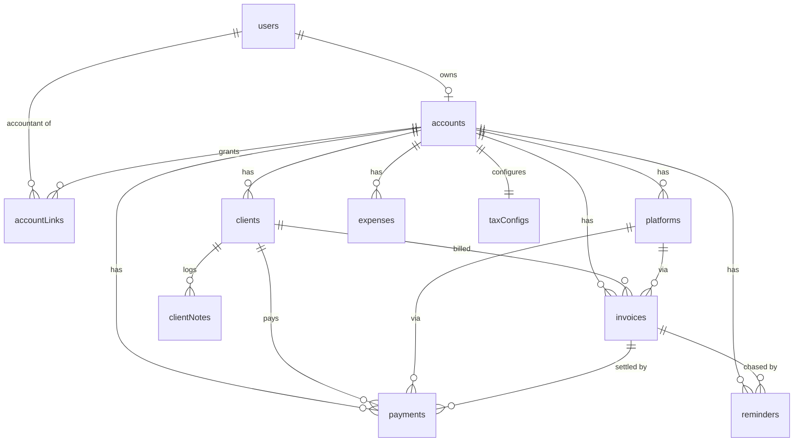

# freelanceOS — Database Design

## Overview

**Engine:** MongoDB (Atlas), accessed via **Mongoose**. Document model fits embedded line items, fee rule sets, and tax slab arrays; per-account config varies freely.

**Design principles:**
- **Money:** every monetary value is an integer **minor unit** field (`...Minor`) paired with a `currency` (ISO-4217 String). Never `Double`.
- **Account scoping:** every business collection carries `accountId` (ref → `accounts`). All queries filter by it. This is the tenancy boundary.
- **Frozen conversions:** Payment/Expense store the forex rate + base-equivalent at write time; never recomputed.
- **Refs over deep nesting** for entities queried independently (clients, invoices, payments). **Embed** for value objects owned by one parent (line items, fee tiers, tax slabs, money sub-docs).
- **Access control:** app-level Mongoose middleware + Express guards (no native RLS). `freelancer` owns; `accountant` is read-only and scoped via `accountLinks`.

**Auth strategy:** custom JWT. `users` holds credentials (bcrypt hash). An `account` = one freelancer's books. Accountants are separate `users` linked via `accountLinks`.

**Type legend:** `ObjectId`, `String`, `Number` (integer minor units unless noted), `Boolean`, `Date`, `Object` (embedded sub-doc), `[ ]` (array).

---

## Collections

### Collection: `users`
**Purpose:** Authentication identity for both freelancers and accountants.
**Relationships:** A freelancer user is referenced by one `accounts` doc (`ownerUserId`). An accountant user is referenced by N `accountLinks`.

| Field | Type | Constraints | Description |
|-------|------|------------|-------------|
| `_id` | ObjectId | PK | — |
| `name` | String | required | Display name. |
| `email` | String | required, unique, lowercase | Login id. |
| `passwordHash` | String | required | bcrypt hash. |
| `role` | String | enum(`freelancer`,`accountant`), required | Global role. |
| `refreshTokenHash` | String | nullable | Hash of current refresh token (for logout/invalidation). |
| `createdAt` | Date | default now | — |
| `updatedAt` | Date | auto | — |

**Indexes:** `{ email: 1 }` unique.
**Access Control:** self-read only; password never serialized.

---

### Collection: `accounts`
**Purpose:** One freelancer's financial workspace + settings. The tenancy root.
**Relationships:** `ownerUserId` → `users`. Referenced by every business collection via `accountId`.

| Field | Type | Constraints | Description |
|-------|------|------------|-------------|
| `_id` | ObjectId | PK | The `accountId` used everywhere. |
| `ownerUserId` | ObjectId | ref `users`, required, unique | Owning freelancer. |
| `baseCurrency` | String | required, default `PKR` | ISO-4217 base/local currency. |
| `taxRegime` | String | enum(`PK_FBR`,`IN_IT`,`BD_NBR`,`CUSTOM`), default `PK_FBR` | Active regime. |
| `fiscalYearStartMonth` | Number | 1–12, default 7 | FBR FY starts July. |
| `dangerZoneThresholdMinor` | Number | default 0 | Cash-flow alert floor (base ccy). |
| `dangerZoneCurrency` | String | default = baseCurrency | Threshold currency. |
| `invoiceSeq` | Number | default 0 | Monotonic counter for invoice numbering. |
| `createdAt` | Date | default now | — |

**Indexes:** `{ ownerUserId: 1 }` unique.
**Access Control:** owner read/write; linked accountants read settings only.
**Seed on create (UC-F01):** default `platforms` (Upwork/Fiverr/Direct), default `taxConfigs` (PK_FBR).

---

### Collection: `accountLinks`
**Purpose:** Read-only access grant from a freelancer account to an accountant user (F-25).
**Relationships:** `accountId` → `accounts`; `accountantUserId` → `users`(role=accountant).

| Field | Type | Constraints | Description |
|-------|------|------------|-------------|
| `_id` | ObjectId | PK | — |
| `accountId` | ObjectId | ref `accounts`, required | Target books. |
| `accountantUserId` | ObjectId | ref `users`, nullable until accepted | Linked accountant. |
| `email` | String | required, lowercase | Invitee email. |
| `inviteToken` | String | unique, nullable after accept | Acceptance token. |
| `status` | String | enum(`pending`,`active`,`revoked`), default `pending` | Link state. |
| `invitedAt` | Date | default now | — |
| `acceptedAt` | Date | nullable | — |

**Indexes:** `{ accountId: 1, email: 1 }` unique; `{ inviteToken: 1 }` unique sparse; `{ accountantUserId: 1 }`.
**Access Control:** freelancer manages; `X-Account-Id` from accountant validated against an `active` link.

---

### Collection: `platforms`
**Purpose:** Configurable per-account platform fee structures (F-08, F-09).
**Relationships:** `accountId` → `accounts`. Referenced by `clients.defaultPlatformId`, `invoices.platformId`, `payments.platformId`.

| Field | Type | Constraints | Description |
|-------|------|------------|-------------|
| `_id` | ObjectId | PK | — |
| `accountId` | ObjectId | ref `accounts`, required | Scope. |
| `name` | String | required | e.g. Upwork. |
| `isSystemDefault` | Boolean | default false | Seeded preset flag. |
| `feeModel` | String | enum(`flat`,`sliding`,`fixed`,`none`), required | Fee strategy. |
| `feeConfig` | Object | required | Shape per model (below). |
| `createdAt` | Date | default now | — |

**`feeConfig` shapes:**
- `flat`: `{ percent: Number }`
- `sliding`: `{ tiers: [ { uptoLifetimeMinor: Number|null, percent: Number } ] }` (null = top band)
- `fixed`: `{ amountMinor: Number, currency: String }`
- `none`: `{}`

**Indexes:** `{ accountId: 1 }`; `{ accountId: 1, name: 1 }` unique.
**Access Control:** owner write; accountant read.
**Seed:** Upwork (`sliding` 10%→5% at 500k lifetime), Fiverr (`flat` 20%), Direct (`none`).

---

### Collection: `clients`
**Purpose:** Client profiles + computed reliability/stats (F-01, F-02, F-03).
**Relationships:** `accountId` → `accounts`; `defaultPlatformId` → `platforms`. Referenced by `invoices`, `payments`, `clientNotes`, `reminders`.

| Field | Type | Constraints | Description |
|-------|------|------------|-------------|
| `_id` | ObjectId | PK | — |
| `accountId` | ObjectId | ref `accounts`, required | Scope. |
| `name` | String | required | — |
| `email` | String | nullable | Contact. |
| `company` | String | nullable | — |
| `billingCurrency` | String | required | Default invoice currency. |
| `defaultPlatformId` | ObjectId | ref `platforms`, nullable | Default platform. |
| `contractTerms` | String | nullable | Free text. |
| `rateAgreement` | Object | nullable | `{ amountMinor, currency, unit:enum(hour,month,project) }`. |
| `reliabilityScore` | Number | 0–100, default 100 | Computed (UC-S02). |
| `stats` | Object | computed | `{ totalInvoicedBaseMinor, totalReceivedBaseMinor, overdueCount }`. |
| `createdAt` | Date | default now | — |

**Indexes:** `{ accountId: 1 }`; `{ accountId: 1, name: 1 }`; `{ accountId: 1, reliabilityScore: -1 }`.
**Access Control:** owner write; accountant read.

---

### Collection: `clientNotes`
**Purpose:** Timestamped communication log per client (F-03).
**Relationships:** `clientId` → `clients`; `accountId` → `accounts`.

| Field | Type | Constraints | Description |
|-------|------|------------|-------------|
| `_id` | ObjectId | PK | — |
| `accountId` | ObjectId | ref `accounts`, required | Scope. |
| `clientId` | ObjectId | ref `clients`, required | Parent. |
| `body` | String | required | Note text. |
| `createdAt` | Date | default now | — |

**Indexes:** `{ clientId: 1, createdAt: -1 }`.
**Access Control:** owner write; accountant read.

---

### Collection: `invoices`
**Purpose:** Invoices with embedded line items + lifecycle/aging (F-04, F-05, F-07, F-20).
**Relationships:** `accountId`→`accounts`; `clientId`→`clients`; `platformId`→`platforms`. Referenced by `payments`, `reminders`.

| Field | Type | Constraints | Description |
|-------|------|------------|-------------|
| `_id` | ObjectId | PK | — |
| `accountId` | ObjectId | ref `accounts`, required | Scope. |
| `number` | String | required, unique per account | `INV-{FY}-{seq}`. |
| `clientId` | ObjectId | ref `clients`, required | — |
| `platformId` | ObjectId | ref `platforms`, required | — |
| `currency` | String | required | Invoice (billing) currency. |
| `issueDate` | Date | required | — |
| `dueDate` | Date | required | — |
| `status` | String | enum(`draft`,`sent`,`partially_paid`,`paid`,`overdue`,`void`), default `draft` | Lifecycle. |
| `lineItems` | [Object] | required, ≥1 | `{ description, quantity, unitPriceMinor, amountMinor }` (amount computed). |
| `subtotalMinor` | Number | computed | Σ line amounts. |
| `taxOnInvoiceMinor` | Number | default 0 | Optional tax line. |
| `totalMinor` | Number | computed | subtotal + tax. |
| `amountPaidMinor` | Number | default 0 | Σ payments (invoice ccy). |
| `amountDueMinor` | Number | computed | total − paid. |
| `notes` | String | nullable | — |
| `pdfUrl` | String | nullable | Last generated S3 presigned URL. |
| `overdueDays` | Number | default 0, computed | UC-S01. |
| `agingBucket` | String | enum(`current`,`d30`,`d60`,`d90plus`), default `current` | UC-S01. |
| `createdAt` | Date | default now | — |
| `updatedAt` | Date | auto | — |

**Indexes:** `{ accountId: 1, status: 1 }`; `{ accountId: 1, clientId: 1 }`; `{ accountId: 1, dueDate: 1 }`; `{ accountId: 1, number: 1 }` unique; `{ accountId: 1, agingBucket: 1 }`.
**Access Control:** owner write; accountant read.

---

### Collection: `payments`
**Purpose:** Core money event — frozen forex + platform fee + net received (F-06, F-09, F-10).
**Relationships:** `accountId`→`accounts`; `invoiceId`→`invoices`; `clientId`→`clients`; `platformId`→`platforms`.

| Field | Type | Constraints | Description |
|-------|------|------------|-------------|
| `_id` | ObjectId | PK | — |
| `accountId` | ObjectId | ref `accounts`, required | Scope. |
| `invoiceId` | ObjectId | ref `invoices`, required | — |
| `clientId` | ObjectId | ref `clients`, required | Denormalized for reports. |
| `platformId` | ObjectId | ref `platforms`, required | Denormalized for reports. |
| `paidAt` | Date | required | Payment date (forex anchor). |
| `grossAmountMinor` | Number | required | Amount client paid (invoice ccy). |
| `currency` | String | required | Invoice currency. |
| `forexRate` | Number | required | base per 1 invoice-ccy at paidAt (frozen). |
| `forexRateSource` | String | enum(`frankfurter`,`exchangerate-api`,`manual`), required | Provenance. |
| `isManualRate` | Boolean | default false | — |
| `platformFeeMinor` | Number | required | Fee in invoice ccy. |
| `platformFeeBaseMinor` | Number | computed | Fee in base ccy. |
| `netReceivedMinor` | Number | computed | gross − fee (invoice ccy). |
| `netReceivedBaseMinor` | Number | computed | Net in base ccy (the figure that feeds income/tax). |
| `grossBaseMinor` | Number | computed | Gross in base ccy. |
| `note` | String | nullable | — |
| `createdAt` | Date | default now | — |

**Indexes:** `{ accountId: 1, paidAt: -1 }`; `{ invoiceId: 1 }`; `{ accountId: 1, clientId: 1 }`; `{ accountId: 1, platformId: 1 }`.
**Access Control:** owner write; accountant read.

---

### Collection: `expenses`
**Purpose:** Business/personal expenses with deductible flag (F-13, F-14).
**Relationships:** `accountId` → `accounts`.

| Field | Type | Constraints | Description |
|-------|------|------------|-------------|
| `_id` | ObjectId | PK | — |
| `accountId` | ObjectId | ref `accounts`, required | Scope. |
| `title` | String | required | — |
| `category` | String | enum(`software`,`hardware`,`internet`,`coworking`,`marketing`,`fees`,`travel`,`other`), required | — |
| `amountMinor` | Number | required | Original currency amount. |
| `currency` | String | required | — |
| `forexRate` | Number | required (1 if currency==base) | Frozen at `incurredAt`. |
| `forexRateSource` | String | enum(`frankfurter`,`exchangerate-api`,`manual`), required | — |
| `amountBaseMinor` | Number | computed | Base-ccy equivalent. |
| `incurredAt` | Date | required | — |
| `isBusiness` | Boolean | default true | Business vs personal. |
| `isDeductible` | Boolean | default true | Reduces taxable income. |
| `note` | String | nullable | — |
| `createdAt` | Date | default now | — |

**Indexes:** `{ accountId: 1, incurredAt: -1 }`; `{ accountId: 1, category: 1 }`; `{ accountId: 1, isDeductible: 1 }`.
**Access Control:** owner write; accountant read.

---

### Collection: `taxConfigs`
**Purpose:** Active tax slab set per account (F-15). One active doc per account.
**Relationships:** `accountId` → `accounts`.

| Field | Type | Constraints | Description |
|-------|------|------------|-------------|
| `_id` | ObjectId | PK | — |
| `accountId` | ObjectId | ref `accounts`, required, unique | One config per account. |
| `regime` | String | enum(`PK_FBR`,`IN_IT`,`BD_NBR`,`CUSTOM`), required | — |
| `currency` | String | required | Slab currency (usually base). |
| `fiscalYearStartMonth` | Number | 1–12 | Mirrors account. |
| `slabs` | [Object] | required, ≥1 | `{ uptoMinor:Number|null, rate:Number, fixedMinor:Number }`. Exactly one `null` ceiling, last. |
| `isCustom` | Boolean | default false | — |
| `createdAt` | Date | default now | — |
| `updatedAt` | Date | auto | — |

**Indexes:** `{ accountId: 1 }` unique.
**Access Control:** owner write; accountant read.

---

### Collection: `reminders`
**Purpose:** Tracked late-payment reminder sequence (F-21). Generation/tracking only — no delivery.
**Relationships:** `accountId`→`accounts`; `invoiceId`→`invoices`; `clientId`→`clients`.

| Field | Type | Constraints | Description |
|-------|------|------------|-------------|
| `_id` | ObjectId | PK | — |
| `accountId` | ObjectId | ref `accounts`, required | Scope. |
| `invoiceId` | ObjectId | ref `invoices`, required | — |
| `clientId` | ObjectId | ref `clients`, required | — |
| `sequenceStep` | Number | required, ≥1 | Position in sequence. |
| `suggestedAction` | String | required | Human-readable nudge. |
| `channel` | String | enum(`email`,`whatsapp`,`manual`), default `email` | Intended channel (tracking). |
| `status` | String | enum(`pending`,`sent`,`skipped`), default `pending` | — |
| `sentAt` | Date | nullable | Set when marked sent. |
| `createdAt` | Date | default now | — |

**Indexes:** `{ invoiceId: 1, sequenceStep: 1 }`; `{ accountId: 1, status: 1 }`.
**Access Control:** owner write; accountant read.

---

### Collection: `forexRates`
**Purpose:** Cache of fetched rates so a (base,quote,date) is fetched once (A-04).
**Relationships:** none (global lookup cache, not account-scoped).

| Field | Type | Constraints | Description |
|-------|------|------------|-------------|
| `_id` | ObjectId | PK | — |
| `base` | String | required | ISO-4217. |
| `quote` | String | required | ISO-4217. |
| `date` | String | required, `YYYY-MM-DD` | Rate date. |
| `rate` | Number | required | quote per 1 base. |
| `source` | String | enum(`frankfurter`,`exchangerate-api`), required | Provider. |
| `fetchedAt` | Date | default now | — |

**Indexes:** `{ base: 1, quote: 1, date: 1 }` unique.
**Access Control:** system read/write; not user-facing.

---

## Cache Layer
N/A — no Redis in v1 (TRD decision #4). `forexRates` collection serves as the only persistent lookup cache.

---

## Enums / Constants

| Name | Values | Used In |
|------|--------|---------|
| UserRole | `freelancer`, `accountant` | `users`, JWT |
| TaxRegime | `PK_FBR`, `IN_IT`, `BD_NBR`, `CUSTOM` | `accounts`, `taxConfigs` |
| FeeModel | `flat`, `sliding`, `fixed`, `none` | `platforms` |
| RateUnit | `hour`, `month`, `project` | `clients.rateAgreement` |
| InvoiceStatus | `draft`, `sent`, `partially_paid`, `paid`, `overdue`, `void` | `invoices` |
| AgingBucket | `current`, `d30`, `d60`, `d90plus` | `invoices`, `GET /overdue` |
| ExpenseCategory | `software`, `hardware`, `internet`, `coworking`, `marketing`, `fees`, `travel`, `other` | `expenses` |
| ForexSource | `frankfurter`, `exchangerate-api`, `manual` | `payments`, `expenses`, `forexRates` |
| ReminderChannel | `email`, `whatsapp`, `manual` | `reminders` |
| ReminderStatus | `pending`, `sent`, `skipped` | `reminders` |
| LinkStatus | `pending`, `active`, `revoked` | `accountLinks` |

## Seed / Default Data

**On account creation (UC-F01):**
- `platforms`: Upwork `{feeModel:"sliding", feeConfig:{tiers:[{uptoLifetimeMinor:50000000,percent:10},{uptoLifetimeMinor:null,percent:5}]}}`; Fiverr `{feeModel:"flat", feeConfig:{percent:20}}`; Direct `{feeModel:"none", feeConfig:{}}`. All `isSystemDefault:true`.
- `taxConfigs`: PK_FBR preset — slabs in PKR minor units (paisa), `fiscalYearStartMonth:7`. (IN_IT, BD_NBR available via `GET /tax/presets`, not seeded.)

**PK_FBR default slabs (illustrative, configurable; amounts in PKR paisa):**
```
[ { uptoMinor: 60000000,   rate: 0,    fixedMinor: 0 },
  { uptoMinor: 120000000,  rate: 15,   fixedMinor: 0 },
  { uptoMinor: 160000000,  rate: 20,   fixedMinor: 9000000 },
  { uptoMinor: null,       rate: 25,   fixedMinor: 17000000 } ]
```

## Relationships (ER)


